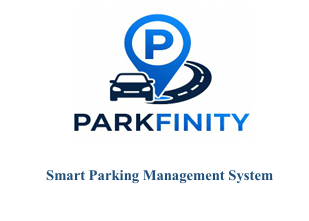

# 🚗 ParkFinity — Smart Parking Management System

<p align="center">
  
</p>

<p align="center">
  <b>Smart • Convenient • Secure Parking Management</b>
</p>

<p align="center">
  A modern smart parking platform designed to simplify parking discovery, reservation, management, and digital payment.
</p>

---

## 📌 Overview

**ParkFinity** is a Smart Parking Management System developed to make parking easier, faster, and more convenient for both parking users and parking-space owners.

The system allows users to find available parking spaces, view parking information, reserve a suitable space, and manage their parking sessions. Parking-space owners can manage their parking facilities, while administrators can monitor and manage the overall platform.

The project consists of a **mobile application** for riders/users and dedicated management interfaces for parking owners and administrators.

---

## 🎯 Objectives

The main objectives of ParkFinity are to:

* 🔎 Help users find available parking spaces easily
* 📍 Provide location-based parking discovery
* 🅿️ Simplify parking space reservation
* 📱 Provide a user-friendly mobile experience
* 👤 Allow parking owners to manage their parking spaces
* 🛠️ Provide administrative control over the platform
* 💳 Support convenient digital payment integration
* 📊 Improve parking management and monitoring
* 🔐 Provide secure user authentication and data management

---

## ✨ Key Features

### 👤 Rider / User

* User registration and login
* User profile management
* Search for available parking spaces
* Location-based parking discovery
* View parking-space details
* Parking reservation
* Parking check-in/check-out
* QR-code based parking verification
* Parking history
* Digital payment
* Notifications

### 🏢 Parking Owner

* Owner registration and authentication
* Owner dashboard
* Add and manage parking spaces
* Update parking-space information
* Manage parking availability
* View reservations
* Monitor parking activities
* Manage parking-related information

### 👨‍💼 Administrator

* Admin authentication
* Administrative dashboard
* User management
* Parking-owner management
* Parking-space management
* Reservation monitoring
* System monitoring
* Platform-level management and control

---

## 🏗️ System Architecture

ParkFinity follows a client-server architecture where the mobile application and management interfaces communicate with the backend services and database.

```text
                    ┌─────────────────────┐
                    │      ParkFinity     │
                    │      Platform       │
                    └──────────┬──────────┘
                               │
             ┌─────────────────┼─────────────────┐
             │                 │                 │
             ▼                 ▼                 ▼
       ┌───────────┐     ┌────────────┐    ┌────────────┐
       │   Rider   │     │   Owner    │    │   Admin    │
       │   App     │     │ Dashboard  │    │  Dashboard │
       └─────┬─────┘     └─────┬──────┘    └─────┬──────┘
             │                 │                 │
             └─────────────────┼─────────────────┘
                               ▼
                    ┌─────────────────────┐
                    │      Backend API    │
                    └──────────┬──────────┘
                               │
                    ┌──────────▼──────────┐
                    │      Database       │
                    └─────────────────────┘
```

---

## 🛠️ Technology Stack

| Component            | Technology                  |
| -------------------- | --------------------------- |
| Mobile Application   | Flutter                     |
| Programming Language | Dart                        |
| Backend              | Node.js / Express.js        |
| Database             | PostgreSQL                  |
| Authentication       | Firebase Authentication     |
| Notifications        | Firebase Cloud Messaging    |
| Maps & Location      | Google Maps                 |
| QR Code              | QR-based Check-in/Check-out |
| Payment              | Digital Payment Integration |
| Version Control      | Git & GitHub                |

---

## 📱 Application Modules

### Rider Application

The rider application provides the main user-facing functionality of ParkFinity.

```text
Authentication
     │
     ├── Login
     └── Registration
           │
           ▼
       Home Screen
           │
     ┌─────┼─────────────┐
     ▼     ▼             ▼
   Map   Parking       Profile
         Search
           │
           ▼
     Parking Details
           │
           ▼
       Reservation
           │
           ▼
       Check-in
           │
           ▼
      Parking Session
           │
           ▼
       Check-out
           │
           ▼
        Payment
```

---

## 🗺️ Parking Discovery

ParkFinity helps users discover parking facilities based on their location.

Users can:

* View parking locations
* Check parking information
* Check availability
* View parking details
* Select a suitable parking facility
* Proceed with reservation

---

## 📲 QR-Based Parking

ParkFinity uses QR-based functionality to simplify parking check-in and check-out.

The QR-based workflow helps connect a user's reservation with their actual parking session and reduces manual verification.

---

## 💳 Digital Payment

The platform is designed to support digital payment for parking services.

Possible payment services include:

* SSLCommerz
* bKash
* Nagad

> Payment integration may depend on the specific deployment and configuration of the system.

---

## 🔔 Notifications

ParkFinity can use Firebase Cloud Messaging (FCM) to provide users with important notifications such as:

* Reservation updates
* Parking-related notifications
* Check-in/check-out updates
* System notifications

---

## 🔐 Security

Security is an important part of the system.

The platform is designed around:

* User authentication
* Role-based access
* Protected administrative functionality
* Secure API communication
* Database access control
* Authentication-based user management

---

## 📂 Project Structure

The repository contains separate components and supporting resources for the ParkFinity system.

```text
ParkFinity-Final/
│
├── parkfinity3/          # Main application
│
├── parkfinity_admin/     # Admin interface
│
├── admin_images/         # Admin-related images
│
├── owner_images/         # Owner-related images
│
├── rider_images/         # Rider-related images
│
├── tools/                # Supporting tools/resources
│
├── .vscode/              # VS Code configuration
│
├── cover_image.png       # Project cover
│
├── ParkFinity Proposal Revised Final.pdf
├── User Manual Report.pdf
├── User Manual for Unihall.pdf
│
└── README.md
```

The repository currently contains the main application, admin component, image resources, tools, project proposal, and user documentation.

---

## 🚀 Getting Started

### Prerequisites

Before running the project, make sure you have the required development environment installed.

Recommended tools:

* Flutter SDK
* Dart SDK
* Android Studio
* Android SDK
* Node.js
* PostgreSQL
* Git

### Clone the Repository

```bash
git clone https://github.com/eftekar1473/ParkFinity-Final.git
```

```bash
cd ParkFinity-Final
```

### Flutter Application

Navigate to the Flutter project:

```bash
cd parkfinity3
```

Install dependencies:

```bash
flutter pub get
```

Check the Flutter environment:

```bash
flutter doctor
```

Run the application:

```bash
flutter run
```

> Make sure an Android emulator or physical Android device is connected before running the application.

---

## ⚙️ Backend Setup

If the backend is included/configured separately, install the required Node.js dependencies:

```bash
npm install
```

Create and configure the required environment variables according to your backend configuration.

Then start the development server:

```bash
npm run dev
```

The exact backend commands may vary depending on the current backend configuration.

---

## 🗄️ Database

ParkFinity uses **PostgreSQL** as its primary database.

The database is responsible for managing information such as:

* Users
* Parking owners
* Parking facilities
* Parking slots
* Reservations
* Parking sessions
* Payments
* System records

Configure the database connection through environment variables rather than committing credentials to the repository.

---

## 🔑 Environment Variables

For security, sensitive credentials should **not** be committed to GitHub.

Example:

```env
DATABASE_URL=your_database_url
JWT_SECRET=your_secret_key
GOOGLE_MAPS_API_KEY=your_google_maps_api_key
FIREBASE_PROJECT_ID=your_firebase_project_id
PAYMENT_API_KEY=your_payment_api_key
```

Create a `.env` file locally and replace the placeholder values with your own credentials.

---

## 📸 Screenshots

Project screenshots and visual assets are available in the repository, including rider, owner, and admin-related images.

You can add screenshots here as the project evolves:

```markdown


```

---

## 📚 Project Documentation

The repository includes project documentation such as:

* 📄 Project Proposal
* 📘 User Manual
* 📘 UniHall User Manual
* 📑 Institute/Project Documentation

These documents provide additional information about the system, its requirements, and its usage.

---

## 👥 User Roles

| Role        | Main Responsibilities            |
| ----------- | -------------------------------- |
| 👤 Rider    | Search, reserve, and use parking |
| 🏢 Owner    | Manage parking facilities        |
| 👨‍💼 Admin | Manage and monitor the platform  |

---

## 🔄 Basic System Workflow

```text
User Registration
        ↓
     Login
        ↓
 Find Parking
        ↓
View Parking Details
        ↓
   Reservation
        ↓
     Payment
        ↓
    Check-in
        ↓
  Parking Session
        ↓
    Check-out
        ↓
   Parking History
```

---

## 🌟 Benefits

ParkFinity aims to provide:

* Reduced time spent searching for parking
* Better utilization of parking spaces
* Convenient parking reservations
* Improved parking management
* Digitalized parking operations
* Better communication between users and parking owners
* Centralized administrative control

---

## 🔮 Future Improvements

Potential future improvements include:

* 🤖 AI-based parking availability prediction
* 📈 Advanced analytics and reporting
* 💰 Dynamic parking pricing
* 🚦 Real-time parking occupancy detection
* 🧠 Smart parking recommendations
* 🗺️ Improved route optimization
* 📱 Enhanced mobile notifications
* 🏙️ Integration with smart-city infrastructure

---

## 🎓 Academic Project

**ParkFinity — Smart Parking Management System** is developed as an academic Software Engineering project.

The project focuses on applying software engineering concepts to solve real-world parking-management challenges through a digital platform.

---

## 📄 License

This project is developed for academic and educational purposes.

---

## 🤝 Contributing

Contributions, suggestions, and improvements are welcome.

If you would like to contribute:

1. Fork the repository
2. Create a new branch
3. Make your changes
4. Commit your changes
5. Push the branch
6. Create a Pull Request

---

## 📬 Contact

For project-related queries or collaboration, please use the GitHub repository:

[ParkFinity-Final Repository](https://github.com/eftekar1473/ParkFinity-Final?utm_source=chatgpt.com)

---

<p align="center">
  <b>🚗 ParkFinity — Making Parking Smarter, Simpler & Better.</b>
</p>
